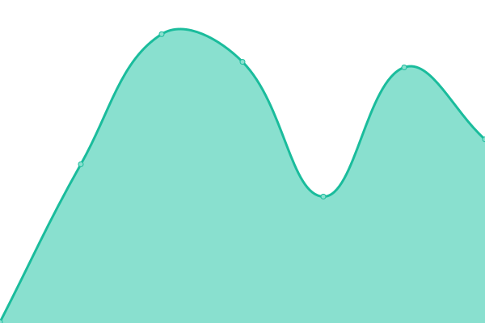

# [📈 Live Status](https://status.1qlabs.ai): <!--live status--> **🟩 All systems operational**

This repository contains the open-source uptime monitor and status page for [1QLabs](https://www.1qlabs.ai), powered by [Upptime](https://github.com/upptime/upptime).

With [Upptime](https://upptime.js.org), you can get your own unlimited and free uptime monitor and status page, powered entirely by a GitHub repository. We use [Issues](https://github.com/1QLabs/status/issues) as incident reports, [Actions](https://github.com/1QLabs/status/actions) as uptime monitors, and [Pages](https://status.1qlabs.ai) for the status page.

<!--start: status pages-->
<!-- This summary is generated by Upptime (https://github.com/upptime/upptime) -->
<!-- Do not edit this manually, your changes will be overwritten -->
<!-- prettier-ignore -->
| URL | Status | History | Response Time | Uptime |
| --- | ------ | ------- | ------------- | ------ |
|  [1QLabs Website](https://www.1qlabs.ai) | 🟩 Up | [1-q-labs-website.yml](https://github.com/1QLabs/status/commits/HEAD/history/1-q-labs-website.yml) | 

 202ms
     
 | 

<a href="https://status.1qlabs.ai/history/1-q-labs-website">100.00%</a>
    

|  [Talking Brands Website](https://www.talkingbrands.ai) | 🟩 Up | [talking-brands-website.yml](https://github.com/1QLabs/status/commits/HEAD/history/talking-brands-website.yml) | 

 217ms
     
 | 

<a href="https://status.1qlabs.ai/history/talking-brands-website">100.00%</a>
    

|  [Talking Brands App](https://app.talkingbrands.ai) | 🟩 Up | [talking-brands-app.yml](https://github.com/1QLabs/status/commits/HEAD/history/talking-brands-app.yml) | 

 128ms
     
 | 

<a href="https://status.1qlabs.ai/history/talking-brands-app">100.00%</a>
    

|  [Adaptive Educational Intelligence (AEI) Website](https://www.thelearning.ai) | 🟩 Up | [adaptive-educational-intelligence-aei-website.yml](https://github.com/1QLabs/status/commits/HEAD/history/adaptive-educational-intelligence-aei-website.yml) | 

 1016ms
     
 | 

<a href="https://status.1qlabs.ai/history/adaptive-educational-intelligence-aei-website">100.00%</a>
    

|  [Adaptive Educational Intelligence (AEI) App](https://app.thelearning.ai) | 🟩 Up | [adaptive-educational-intelligence-aei-app.yml](https://github.com/1QLabs/status/commits/HEAD/history/adaptive-educational-intelligence-aei-app.yml) | 

 179ms
     
 | 

<a href="https://status.1qlabs.ai/history/adaptive-educational-intelligence-aei-app">100.00%</a>
    

<!--end: status pages-->

[**Visit our status website →**](https://status.1qlabs.ai)

## 📄 License

- Powered by: [Upptime](https://github.com/upptime/upptime)
- Code: [MIT](./LICENSE) © [Anand Chowdhary](https://anandchowdhary.com), supported by [Pabio](https://pabio.com)
- Data in the `./history` directory: [Open Database License](https://opendatacommons.org/licenses/odbl/1-0/)
